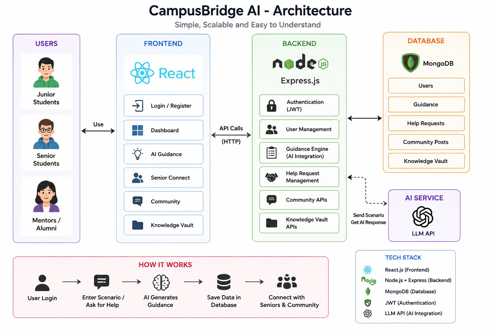

# 🎓 CampusBridge AI

> **Your AI-powered career launchpad** — helping students become employable in an AI-driven future through personalized AI guidance, senior mentorship, and community knowledge sharing.

---

## ✨ Features

| Feature | Description |
|---|---|
| 🔐 **Authentication** | JWT-based signup/login with role selection (Junior / Senior / Mentor) |
| 🤖 **AI Guidance Engine** | Powered by Llama 3.3 (Groq) — generates personalized career roadmaps |
| 🤝 **Senior Connect** | Juniors post help requests; Seniors/Mentors accept them |
| 💬 **Community Feed** | Post doubts, resources, discussions with type-based filtering |
| 📚 **Knowledge Vault** | Curated resource links from seniors (notes, interview tips, hackathon guides) |

---

## 🛠️ Tech Stack

- **Frontend**: React.js + Vite + React Router
- **Backend**: Node.js + Express.js
- **Database**: MongoDB (Mongoose)
- **Authentication**: JWT + bcryptjs
- **AI**: Llama 3.3 70B via Groq API (`llama-3.3-70b-versatile`)
- **Styling**: Vanilla CSS (dark glassmorphism theme)

#Architecture Diagram

---

## 📁 Project Structure

```
Hack/
├── client/          # React frontend (Vite)
│   └── src/
│       ├── api/         # Axios instance
│       ├── components/  # Navbar, ProtectedRoute
│       ├── context/     # AuthContext
│       └── pages/       # All 7 pages
│
└── server/          # Node.js + Express backend
    ├── models/      # Mongoose models
    ├── routes/      # Express routes
    ├── middleware/  # JWT auth middleware
    └── server.js   # Entry point
```

---

## 🚀 Setup Instructions

### Prerequisites

- Node.js v18+
- MongoDB (local) **or** MongoDB Atlas (cloud)
- Google Gemini API key — [Get one free here](https://aistudio.google.com/app/apikey)

---

### 1. Clone / Download the Project

```bash
# Already in your Hack/ directory
```

---

### 2. Backend Setup

```bash
cd server
```

**Configure Environment Variables:**

Open `server/.env` and fill in:

```env
PORT=5000
MONGO_URI=mongodb://localhost:27017/campusbridge
JWT_SECRET=campusbridge_super_secret_jwt_key_2024
GEMINI_API_KEY=your_gemini_api_key_here
```

> **Get Gemini API Key:**
> 1. Go to [aistudio.google.com](https://aistudio.google.com/app/apikey)
> 2. Sign in with Google
> 3. Click "Create API key"
> 4. Copy and paste into `.env`

**Install & Start:**

```bash
npm install        # Already done
npm start          # Starts on http://localhost:5000
```

---

### 3. Frontend Setup

```bash
cd client
npm install        # Already done
npm run dev        # Starts on http://localhost:5173
```

---

### 4. Open the App

Navigate to **http://localhost:5173** in your browser.

---

## 🧪 Sample Data / Test Flow

### Step 1: Register Accounts
Create 3 accounts with different roles to test all features:

| Name | Email | Role |
|---|---|---|
| Alice (Junior) | alice@test.com | Junior Student |
| Bob (Senior) | bob@test.com | Senior Student |
| Carol (Mentor) | carol@test.com | Mentor |

### Step 2: Test AI Guidance (Login as Alice)
- Go to **AI Guidance**
- Fill in: Year = 2nd Year, Dept = Computer Science, Goal = ML Engineer
- Problem: "I want to get a machine learning internship but don't know where to start"
- Click **Generate Guidance**

### Step 3: Test Senior Connect
- As Alice: Create a help request (e.g., "How to prepare for ML interviews?")
- Login as Bob → Go to Senior Connect → Accept Alice's request

### Step 4: Community & Vault
- Post doubts/resources in Community
- Add resource links in Knowledge Vault

---

## 🔌 API Reference

| Method | Endpoint | Description |
|---|---|---|
| POST | `/api/auth/signup` | Register new user |
| POST | `/api/auth/login` | Login + get JWT |
| POST | `/api/guidance/generate` | Generate AI guidance |
| GET | `/api/guidance/history` | User's guidance history |
| POST | `/api/help/request` | Create help request |
| GET | `/api/help/requests` | Get help requests |
| PUT | `/api/help/accept/:id` | Accept a request |
| POST | `/api/community/post` | Create community post |
| GET | `/api/community/posts` | Get all posts |
| POST | `/api/vault/resource` | Add vault resource |
| GET | `/api/vault/resources` | Get all resources |

---

## ⚙️ Using MongoDB Atlas (Cloud)

If you don't have MongoDB installed locally:

1. Go to [mongodb.com/atlas](https://www.mongodb.com/cloud/atlas)
2. Create a free cluster
3. Click **Connect** → **Connect your application**
4. Copy the connection string
5. Replace `MONGO_URI` in `server/.env` with your Atlas string

---

## 🎨 Design

- **Theme**: Dark glassmorphism
- **Colors**: Indigo (#6366f1) + Violet (#8b5cf6) accent palette
- **Font**: Inter (Google Fonts)
- **Animations**: Fade-in, hover lift, loading spinners

---

## 📝 Notes

- AI Guidance requires a valid Gemini API key. Without it, you'll see a 500 error on generate.
- All passwords are hashed with bcryptjs (12 rounds) before storage.
- JWT tokens expire in 7 days.
- No file uploads — Knowledge Vault stores URLs only.
